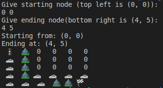

# Basic A* Search Program

## Description
This program implents a basic A* Search Algorithm to find a solution path. The A* Search Algorithm can be used a path search algorithm for travel-routing, or in this case to find a path through the maze. 

The user will be prompted to enter a starting and ending node via the command line. The size of the point of the board will be given to them before by printing out the top left node and the bottom right node (the most common nodes for starting and ending positions).Based off of the starting and ending nodes, the A* Search Algorithm will find a path through the maze.

The maze that being used is located in the 'examplemaze.txt' file. Open nodes, nodes where the user can go, are distinguished by the number '0'. Obstacles in the maze, or nodes where the user cannot go, are distinguished by the number '1'. You can add, subtract, or alter the layout of the maze, just make sure that number is separated by a ',' and that line ends in a ',' as that is how the program detects and separates nodes.

## Screenshot

## Installation
1. Fork repository
2. Clone repository to machine using terminal and 'git clone'

## Notes
- This program was built on a Linux-system and compiled using g++

## Support
If you have issues or suggestions, please email me at samueldmaus@gmail.com